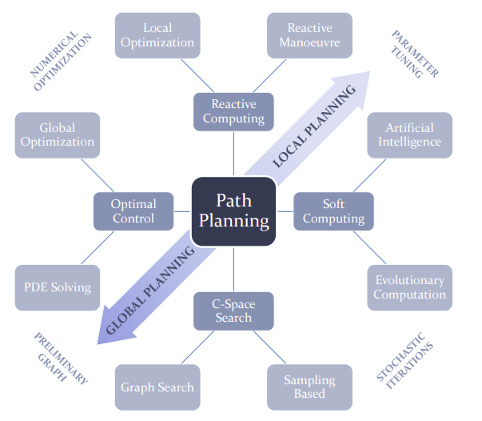

# Path Planning for Autonomous Mobile Robots: A Review
Autonomous navigation is a valuable asset for mobile robots. It helps to mitigate their
dependency on human intervention.

- The best path here refers to the optimal one, in the
sense that the resulting path comes from minimizing one or more objective optimization
functions. For instance, this path may be the one entailing the least amount of time. This is
critical in missions such as those of the search-and-rescue field [1]: victims of a disaster
may ask for help in life-or-death situations. Another optimization function to consider
could be the energy of the robot

-  In the case of planetary exploration, this is critical since
rovers have limited energetic resources available. At the same time, the path generated
by the planner must follow any imposed restrictions. These may come from the limitations
in the adaptability of the robot to certain terrains. The locomotion of the robot and the
characteristics of the existing terrain limit the kind of manoeuvres that can be performed.

## Path Planning Workspace Modeling

A path planner needs to be fed with information describing the environment.
This
information can describe, for example, the presence of obstacles or the features of the
surface that are relevant to the planning. In addition, the criteria used to calculate the path
has to do with the way the robot interacts with this environment

### Environment Modeling

Surface mobile robots drive from one position to another within a certain region in
space. 

## Reference
1.<https://www.mdpi.com/1424-8220/21/23/7898>